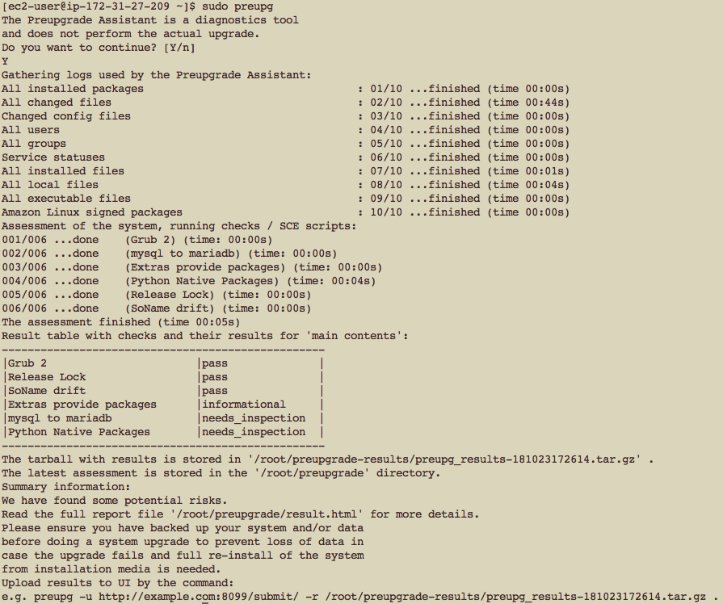
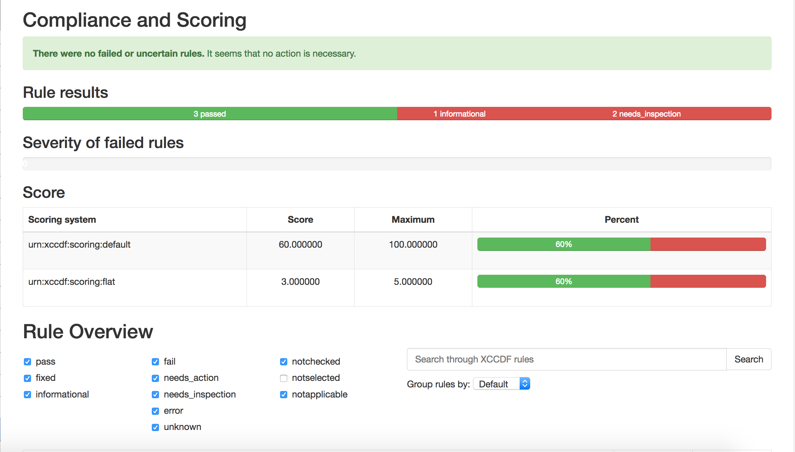

## Pre-upgrade Assistant for Amazon Linux
The preupgrade assistant for Amazon Linux makes it easier to migrate to [Amazon Linux 2](https://aws.amazon.com/amazon-linux-2/) from [Amazon Linux AMI](https://aws.amazon.com/amazon-linux-ami/). You can run the preupgrade assistant on your Amazon Linux AMI installation to check for incompatibilities in packages, libraries, services, command-line options, and configuration files. The assistant produces a report outlining potential incompatibilities and offers suggestions to mitigate them.

You will need to install both the preupgrade-assitant RPM installed and the Amazon Linux module by running sudo yum install -y preupgrade-assistant preupgrade-assistant-al1toal2 and run the assistant  as sudo preupg.

AWS does not recommend using the preupgrade assistant on production systems.

Example showing usage:

The assistant produces a report in the `/root/preupgrade` directory that is viewable with a web browser.  

Example report:

The compatibility results are classified into passing or failing and further into informational failures and failures that need manual inspection. You can also examine the details of failures.

The assistant also produces scripts for running after upgrade to Amazon Linux 2 to match the state to the original Amazon Linux AMI installation. These scripts are placed in `/root/preupgrade/postupgrade.d`
Further, any scripts which are optionally generated for running after upgrade to Amazon Linux 2 to match the state to you your Amazon Linux AMI installation can be found at `/root/preupgrade/postupgrade.d`

## Amazon Linux Upgrade Modules

AWS module for testing upgrades from Amazon Linux (1) AMI to Amazon Linux 2 using the preupgrade-assistant.

## License

This library is licensed under the Apache 2.0 License. 
